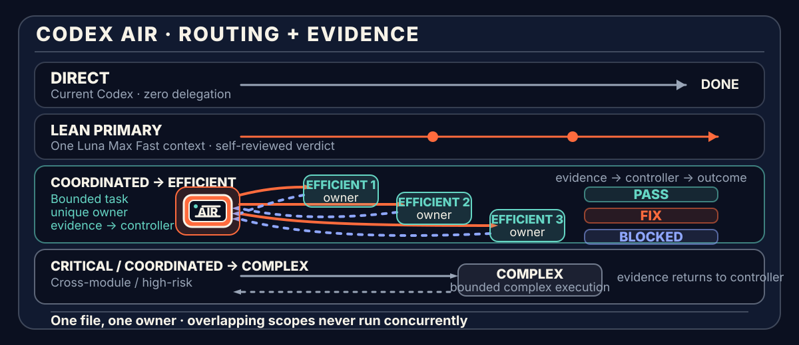

[简体中文](README.md) · [English](README.en.md)


<p align="center">
  <a href="https://github.com/SII-k7/codex-air/actions/workflows/posix-validation.yml"></a>
  <a href="https://github.com/SII-k7/codex-air/actions/workflows/windows-validation.yml"></a>
  <a href="LICENSE"></a>
  <a href="https://github.com/SII-k7/codex-air/stargazers"></a>
</p>

# Codex AIR

**Plan the work. Route the right model. Prove the result.**

`codex-air` is an explicit-only, model-neutral orchestration Skill for Codex. It runs only when you invoke `$codex-air`: **one Luna Max Fast Primary owns ordinary work end to end; eligible wide tasks use a Luna Max Fast controller to dispatch two or three Luna Max Fast owners concurrently and perform one aggregate review.**

[60-second quickstart](#60-second-quickstart) · [Routes](#how-it-works) · [Cost model](#why-it-can-reduce-cost) · [Runtime evidence](#current-status) · [Install and maintenance](#install-check-and-uninstall)

You provide the goal, completion criteria, and constraints. AIR handles planning, capability routing, file ownership, staged execution, verification, and evidence review.

- **Lean Primary** is the default route: the Host forwards the raw request and Luna Max Fast owns requirements, execution, verification, and terminal review.
- **Parallel AIR** launches two or three Luna Max Fast workers only when parallelizable work is at least 65%, the largest branch is at most 60% of that parallelizable share, coordination and integration are at most 15% of Lean serial work, and write scopes are disjoint; otherwise it falls back to Lean.
- **Controller** exists only for admitted parallel work, planning/review-only work, or critical risk. The ordinary controller is also Luna Max Fast; only the critical controller uses Sol Max.
- **Complex worker** handles exception tasks only when they carry an explicit high-consequence, concurrency, migration, unresolved public-interface, irreducible-context, or zero-write capability-mismatch trigger.
- **Efficient worker** is the default implementation owner and handles bounded reversible diagnosis, ordinary multi-file work, tests, refactors, documentation, and configuration on Luna Max with its own pinned Fast tier.

Codex AIR is now **explicit-only**: it starts only when your request contains `$codex-air`; every other request stays with the current Codex session. If an older install enabled global default routing, remove it safely with `bash scripts/default.sh disable`.

Runtime output defaults to Simplified Chinese unless the user explicitly requests another language.

Repository: [SII-k7/codex-air](https://github.com/SII-k7/codex-air). Codex AIR is independently designed and maintained by SII-k7; it is not an official OpenAI product or endorsement. `$codex-prove` is only a compatibility command.

## Core routing and projected savings

The table below uses an “all work performed by Sol” baseline of `1.00×`. Model token shares total 100%. `Orchestration overhead` represents additional planning, review, coordination, and necessary rework as a fraction of the all-Sol baseline. Lean AIR targets at least 70% of model tokens on Luna and at most 30% on Sol.

| Scenario | Example token routing | Orchestration overhead | Projected saving |
| --- | --- | ---: | ---: |
| **Ordinary clear project** | Sol 10% · Terra 20% · Luna 70% | 3%–7% | **72.2%–76.2%** |
| **Mixed project** | Sol 20% · Terra 40% · Luna 40% | 2%–12% | **50.4%–60.4%** |
| **Complex project** | Sol 25% · Terra 60% · Luna 15% | 7%–17% | **33.4%–43.4%** |
| **Direct small task** | The current Codex completes it without delegation | 0% | **0% routing saving** |

These ranges are `scenario_model_projection` values based on public Codex token credits and example token shares. They are for budget planning, **not per-task guarantees or latency promises**.
They use Standard-tier credit weights. API dollar prices no longer share the same ratios as credits, so API cost must be recalculated from actual token types and tiers below. This fork now pins Luna to Fast independently, so actual Luna API cost is higher than the Standard-tier projection.

## 60-second quickstart

### Ubuntu / macOS / Linux

```sh
curl -fsSL https://chatgpt.com/codex/install.sh | sh

git clone https://github.com/SII-k7/codex-air.git
cd codex-air

bash scripts/validate.sh
bash scripts/install.sh
bash scripts/doctor.sh --require-codex
bash scripts/default.sh status
```

### Windows

Windows PowerShell 5.1:

```powershell
git clone https://github.com/SII-k7/codex-air.git
Set-Location codex-air

powershell.exe -NoProfile -ExecutionPolicy Bypass -File scripts/validate.ps1
powershell.exe -NoProfile -ExecutionPolicy Bypass -File scripts/install.ps1
```

PowerShell 7:

```powershell
pwsh -NoProfile -File scripts/validate.ps1
pwsh -NoProfile -File scripts/install.ps1
```

Open a new Codex session after installation:

```text
$codex-air

Goal: Add account settings to the existing application.
Done when: Users can update their display name and avatar; existing authentication APIs remain compatible; tests and build pass.
Constraints: Do not modify payments and do not replace the existing UI framework.
```

A one-line request also works:

```text
$codex-air Refactor the authentication module, preserve the current API, and make sure tests and build pass.
```

You do not need to choose a worker count or model. Ordinary one-owner work enters Lean AIR directly; only independent workstreams that pass the quantified gate create Parallel AIR, while critical risk still enters Critical AIR.

## Decide whether orchestration is worth it

| Keep the current Codex Direct | Explicitly use `$codex-air` |
| --- | --- |
| One file, a small edit, or a located issue | Multiple modules, strong dependencies, shared interfaces, or high-consequence changes |
| Simple answers, deterministic commands, or short text | Decomposition, parallelism, ownership, or independent evidence review matters |
| Orchestration costs more than implementation | Rework costs more than planning and review |

AIR is neither the default mode nor a permanent agent team. It uses workers only when orchestration can improve delivery quality or reduce total cost.

## Why it can reduce cost

The cost strategy is straightforward:

> **Let Luna own ordinary diagnosis, implementation, testing, and coordination; reserve Sol for critical risk and necessary compact review.**

Using the official short-context API prices checked on **2026-08-22**, relative costs vary by token type:

| Model | Relative cost | Responsibility in this project |
| --- | ---: | --- |
| **Sol** | **1.00×** | Critical controller and risk-triggered challenger only; ordinary Lean has zero Sol children |
| **Terra Max** | **0.50× input/cached; 0.60× output** | Explicit complex-trigger and high-consequence execution |
| **Luna Max** | **0.05× input/cached; 0.06× output (Standard)** | Lean Primary and ordinary coordination controller; both request Fast |

For the same token type:

- Terra Standard is **50% of Sol input/cached and 60% of Sol output**;
- Luna Standard is **5% of Sol input/cached and 6% of Sol output**; Luna Fast is **10% of input/cached and 12% of output**;
- Luna is the primary execution and ordinary coordination capability; Sol retains critical-risk and safety-boundary duties.

These values are `scenario_model_projection`: they are planning estimates, **not matched A/B experiments, not per-task guarantees, and not latency promises**. Repeated context, poor decomposition, parallel waiting, output volume, Fast mode, and rework can reduce or reverse the saving.

The Luna Primary and ordinary controller permanently set
`model_reasoning_effort = "max"`, `service_tier = "fast"`, and
`features.fast_mode = true`, so their Fast preference does not depend on the main
session's `/fast` state and is never downgraded to save credits. OpenAI documents
**1.5×** generation speed and **2.5× ChatGPT credit** consumption for Codex Fast;
through the API, current short-context Luna Priority prices are **2×** Standard.
The response's actual tier is authoritative, and a downgrade must be priced as
Standard. The scenario projections above retain Standard Codex-credit weights; new
matched evaluations use the actual request/response tier and target
`AIR / Direct <= 0.55`.

Both Luna profiles also set `model_verbosity = "low"`,
`model_reasoning_summary = "none"`, `tool_output_token_limit = 4000`, and
`personality = "none"` to reduce non-delivery prose and oversized tool returns;
these settings do not lower `model_reasoning_effort = "max"`. The efficient
profile additionally disables subagents to prevent recursive growth on the Lean
path, while the controller retains the dispatch capability needed by coordinated
Full AIR.

Every Sol and Terra custom agent pins `service_tier = "default"`. This guards
against a multi-agent runtime carrying a stale Fast selection into a newly
spawned child ([OpenAI Codex #38277](https://github.com/openai/codex/issues/38277)):
AIR will not silently spend Fast credits on the critical controller, complex
worker, or challenger. The tradeoff is intentional: the main session's `/fast`
toggle no longer changes non-Luna AIR roles; both Luna roles remain Max + Fast.

All five AIR custom agents also pin `model_context_window = 272000` and
`model_auto_compact_token_limit = 244800`. Custom agents are spawned-session
configuration layers, so omitting these keys would inherit Host overrides.
Pinning them keeps a user's main-session `512000/400000` settings out of AIR
children. 272K is the current Codex GPT-5.6 raw default and the auto-compact
threshold follows the official 90% implementation; Codex's 95% effective-window
allowance makes the child UI report about 258.4K. The project will update these
pinned defaults alongside future model configuration changes.

A defensible public claim is therefore:

> **Ordinary clear projects can project roughly 72%–76% savings, typical mixed projects roughly 50%–60%, and complex projects roughly 33%–43%; actual results must be recalculated from real routing and token usage.**

It is not accurate to compress every workload into a fixed “56% average saving.”

<details>
<summary><strong>View official rates, formula, and full calculation</strong></summary>

### API prices

Per 1M tokens:

| Model | Input | Cached input | Output |
| --- | ---: | ---: | ---: |
| GPT-5.6 Sol | $4.00 | $0.40 | $20.00 |
| GPT-5.6 Terra | $2.00 | $0.20 | $12.00 |
| GPT-5.6 Luna | $0.20 | $0.02 | $1.20 |
| GPT-5.6 Luna Fast | $0.40 | $0.04 | $2.40 |

### Codex token-based credits

Per 1M tokens:

| Model | Input | Cached input | Output |
| --- | ---: | ---: | ---: |
| GPT-5.6 Sol | 125 credits | 12.5 credits | 750 credits |
| GPT-5.6 Terra | 50 credits | 5 credits | 300 credits |
| GPT-5.6 Luna | 5 credits | 0.5 credits | 30 credits |

Codex token-based credits retain these relative weights:

```text
Sol = 1.00
Terra = 0.40
Luna = 0.04
```

The following formula is therefore only for credit-based scenario projections; it does not replace an API-dollar calculation:

```text
route_cost =
  sol_share × 1.00
  + terra_share × 0.40
  + luna_share × 0.04
  + orchestration_overhead

saving = 1 - route_cost
```

Ordinary clear project example:

```text
route_cost
= 0.10 × 1.00
+ 0.20 × 0.40
+ 0.70 × 0.04
+ 0.03–0.07
= 0.238–0.278

saving
= 1 - 0.238–0.278
= 72.2%–76.2%
```

API users see dollar charges; ChatGPT / Codex users usually see credits or included capacity. They are different accounting units, so API dollar savings should not be described as an identical subscription-bill saving.

Official sources:

- [OpenAI model comparison](https://developers.openai.com/api/docs/models/compare)
- [OpenAI API pricing](https://developers.openai.com/api/docs/pricing)
- [OpenAI Codex rate card](https://help.openai.com/en/articles/20001106-codex-rate-card)
- [OpenAI Codex Fast mode](https://developers.openai.com/codex/agent-configuration/speed)

A small subset of Enterprise workspaces still using the legacy rate card should use the rate card that actually applies to their workspace.

</details>

## What it solves

| Common problem | Codex AIR's response |
| --- | --- |
| Every small task starts an expensive controller first | Lean Primary lets Luna execute and review end to end while the Host stays a thin transport layer |
| A child reports changed files but the active workspace stays unchanged | The child returns paths and final hashes only; the Host makes Git snapshot and replay the visible candidate before delivering `PASS` |
| Every task uses the highest-cost model | Execution is routed to efficient or complex capability profiles |
| Multiple executors touch shared files | **One file, one owner**; overlapping work runs sequentially |
| “Done” is reported without inspectable proof | Results must include changed paths, diff, tests, builds, or artifacts |
| A failed task loops forever or terminates too early | One focused fix per candidate; recoverable blockers get one same-run Recovery Re-plan |

The goal is not a noisy multi-agent team. It is the shortest safe path for ordinary work and a clear, auditable control plane for complex work.

## How it works



```text
User goal
   │
   ▼
Host: risk and route gate
   │
   ├─ Direct: the current Codex handles simple work
   ├─ Lean: Luna Primary derives requirements → implements → verifies → reviews
   ├─ Parallel: gate passes → Luna controller → 2–3 Luna Fast workers
   └─ Critical: Sol controller → complex / isolated efficient workers
   │
   ▼
Lean: Luna Primary → PASS / REVIEW_REQUIRED / BLOCKED
Full: selected controller → PASS / FIX / BLOCKED
   │
   ▼
Host: make Git snapshot/replay the candidate and compare paths/hashes; no semantic reread or re-review
```

<details>
<summary><strong>Expand the complete control protocol: roles, routing, parallelism, verification, and failure handling</strong></summary>

<br>

### Evidence-first control

The current contract keeps zero controllers on Lean and exactly one controller
on Full AIR. It retains five quality controls:

1. **Requirement-to-evidence graph.** Every `done_when` item has a stable `REQ-ID`; tasks, verification, and final evidence map back to it.
2. **Artifact-first review.** The Luna Primary on Lean or the selected Full controller reads requirements, real changed paths, files, complete diff, and verification artifacts. The Host does not repeat that review.
3. **Verify the verifier.** Exit zero is insufficient. The check must target the final candidate, correct scope, and intended requirement; wrong-module and existence-only checks do not pass.
4. **Selective challenge.** Lean and ordinary coordinated work have zero extra challenge calls. Only critical risk, materially conflicting final-candidate evidence, or an unresolved security or authorization requirement may receive at most one read-only challenge. It returns findings; the Full controller retains the verdict.
5. **Recoverable execution.** Long runs preserve owners, candidate identity, requirement coverage, attempts, and recovery chains; runtime, dependency, or verification failures can re-plan in the same run without redispatching completed work or resetting budgets.

### Role hierarchy

| Role | Configuration | Owns | Explicit boundary |
| --- | --- | --- | --- |
| **Controller** | `air-controller` → `gpt-5.6-luna` / `max` / `fast` / `read-only` | Parallel admission, planning, routing, ownership, and one aggregate review | Permanently Max + Fast; does not implement and is absent from Lean |
| **Critical controller** | `air-critical-controller` → `gpt-5.6-sol` / `max` / `default` / `read-only` | Planning and review for auth, secrets, payments, migrations, concurrency, production, privacy, or irreversible work | Pinned Standard; selected only at entry |
| **Complex worker** | `air-complex-worker` → `gpt-5.6-terra` / `max` / `default` / `workspace-write` | Explicit exceptions: architecture/public-interface judgment, irreducible context, migration/concurrency correctness, or high-consequence implementation | Pinned Standard; requires a recorded escalation trigger and creates no subagents |
| **Efficient / Lean Primary** | `air-efficient-worker` → `gpt-5.6-luna` / `max` / `fast` / `workspace-write` | Owns requirements, execution, verification, artifact review, and terminal verdict on Lean; bounded leaf under Full | Fast pinned; no scope expansion or subagents; overall approval only in Lean mode |
| **Challenger** | `air-challenger` → `gpt-5.6-sol` / `max` / `default` / `read-only` | One bounded adversarial evidence check of a qualifying candidate | Pinned Standard; zero calls for ordinary work and no approval authority |

Role names stay stable; the models after each arrow are the optimized fork defaults. Future model generations update TOML, validation, and release notes without renaming the project or protocol.

### Route selection

| Route | Use it when | Cost implication |
| --- | --- | --- |
| **Direct** | `$codex-air` was not explicitly invoked | No AIR overhead; 0% routing saving |
| **Lean Primary** | Explicit AIR, one logical owner, and reversible workspace scope | Default; Luna owns requirements, execution, verification, and review in one context; zero Sol children for ordinary work |
| **Parallel AIR** | Two or three independent owners; parallel share ≥65%, largest branch ≤60% of that share, coordination/integration ≤15% of Lean serial work | Luna controller plus 2–3 peer Luna Max Fast workers; otherwise `LEAN_RECOMMENDED` |
| **Critical/Controller → complex** | Critical risk, architecture/public interface, migration/concurrency, irreducible context, or evidence conflict | Sol critical controller or Luna coordinated controller routes to Terra |

The complex worker is not the efficient worker's manager and is not a permanent second controller. Lean selects efficient directly; only Full AIR asks its selected controller to route workers.

Luna `max` is now the only semantic task-context owner for ordinary work. In one context it derives requirements, records the baseline, diagnoses, edits, verifies the final candidate, and issues the terminal verdict. Because Codex children may run in isolated worktrees, Luna keeps the reviewed candidate session-visible and returns exact relative paths plus final file hashes only. The Host makes Git generate the binary diff and reverse/forward replay it without sending patch text through a model; it does not read file contents, rerun tests, or perform a second semantic review. Only multiple-owner coordination, architecture/public-interface decisions, migration/concurrency, irreducible context, evidence conflict, or critical risk enters Full AIR.

### How multiple executors cooperate

An admitted task can use two or three workers concurrently, but parallelism
follows both **file ownership** and critical-path value, not agent count:

```text
Stage 1
├─ Complex A   → src/auth/core/*
├─ Efficient A → src/account/ui/*
└─ Efficient B → docs/account.md

Stage 2
└─ original designated owner → src/shared/routes.ts
```

Only tasks with completely disjoint write scopes may run together. Shared files have one designated owner. If dependencies, interfaces, or overlap are uncertain, the controller merges the work or schedules it sequentially.

Ordinary Parallel AIR runs at most three leaves concurrently. The controller
launches one ready frontier as a single batch, uses one long wait, assembles one
disjoint path/hash union manifest in deterministic Task-ID order, invokes Git
persistence once, and performs one aggregate review. A
wider graph runs in dependency-aware waves. Insufficient capacity or a failed
gate falls back to Lean; Terra is never used merely as a speed worker.

## One complete evidence loop

1. **Dispatch.** The Host forwards only the raw request, explicit constraints, workspace, and authorization boundary.
2. **Extract requirements.** Luna Primary assigns stable `REQ-ID`s and evidence.
3. **Execute.** Luna Primary records the baseline, diagnoses, edits, and verifies.
4. **Self-review.** The same Primary inspects real files, complete diff, verifier target, and final candidate.
5. **Decide.** Lean returns `PASS / REVIEW_REQUIRED / BLOCKED`; Full returns `PASS / FIX / BLOCKED`.
6. **Persist and relay.** After matching final hashes, the Host makes Git snapshot and reverse/forward replay the session-visible candidate in one transaction, then delivers the structured terminal result without a second semantic judgment.

## Non-negotiable boundaries

1. **One file, one owner.** Two workers never modify the same file in one run.
2. **Execution profiles do not create subagents.** Complex and efficient never recurse; efficient is Primary on Lean and a leaf under Full.
3. **No evidence, no completion.** Transport / spawn `completed` proves delivery only.
4. **Verification binds to the final candidate.** A later file change invalidates stale evidence.
5. **Correction and recovery are bounded.** Each candidate gets at most one focused fix; each recoverable failure chain gets at most one same-run Recovery Re-plan before `BLOCKED`.
6. **Capability is not authorization.** Broader runtime access never expands user authorization or `write_scope`; the Lean Primary records its baseline and checks final changed paths.
7. **Review standards do not fall.** Urgency, parallelism, or cost goals never replace verification and evidence.
8. **PASS requires artifact evidence.** The Lean Primary or Full controller reconstructs the claim from real artifacts, complete diff, and final candidate; the Host performs no second model review.
9. **Child-worktree results must persist.** A write-capable child's `PASS` is not delivery evidence. A missing visible candidate, path/hash mismatch, non-Git root, or replay failure fails closed; no model guesses or rewrites a patch.
10. **A challenge is not a second controller.** It is read-only, cannot approve, and adds no fixed call cost to ordinary tasks.
11. **High-risk work still fails closed.** Block when model identity, fork, or required scope evidence is unprovable. Destructive, production, or irreversible external work additionally requires an enforceable matching boundary or explicit user approval for the broader capability.

### Bounded efficient-to-complex escalation

Only when an efficient worker's first failure occurs **before** any owned write may the controller escalate the same task and unchanged scope to the complex profile once.

The gate is zero-write state before the first failure.

After a worker writes an owned file, that path belongs to a stable logical owner. The controller may return a focused fix or same-run recovery only to that owner; it may not hand the path to another profile. If the worker process exited, the Host may restore the same owner slot only with the same exact profile after a fresh authoritative launch proof and an artifact snapshot.

A failed focused fix no longer ends AIR automatically. For `runtime`, `timeout`, `dependency`, `verification`, or `evidence_quality`, the Full controller preserves the same `run_id`, completed evidence, ownership, and attempts, then creates one Recovery Re-plan for the affected Requirement chain with new Task IDs, a material Delta, exact scopes, and a resume condition. Written paths remain with the original logical owner; only a wholly disjoint blocker-removal scope may receive a new owner. A still-live agent is reused without an identity handshake or another `$codex-air` invocation.

To prevent task-renaming loops, each Requirement chain gets one Recovery Re-plan and its recovery task gets one focused fix. Terminal `BLOCKED` is reserved for hard permission/identity/scope/irreversible blockers, no material recovery Delta, or failure after that bounded recovery chain.

## Review outcomes

| Verdict | Meaning |
| --- | --- |
| `PASS` | Every completion criterion is supported by real files and fresh evidence |
| `FIX` | Intermediate control action: the logical owner performs a focused fix, or the controller enters eligible same-run recovery |
| `BLOCKED` | A hard blocker exists, no material recovery Delta exists, or the bounded recovery chain is exhausted |

The three outcomes form a closed verdict vocabulary. Optional improvements and residual suggestions remain outside the verdict, but an unsatisfied `REQ-ID` can never be downgraded to a suggestion.

</details>

## When not to use it

The current Codex session is usually better for:

- a small change to one well-understood function;
- a localized typo, copy, or styling fix;
- code explanation, question answering, or short-form writing;
- work that cannot be divided into independent write scopes;
- tasks where orchestration, repeated context, and review cost more than implementation.

Codex AIR never starts implicitly. **Only requests containing `$codex-air` enter orchestration; every other request remains Direct.**

## Install, check, and uninstall

### Ubuntu / macOS / Linux

```sh
# Upgrades from a release that enabled global default routing: remove only the managed block
bash scripts/default.sh disable

bash scripts/validate.sh
bash scripts/install.sh --check
bash scripts/install.sh
bash scripts/doctor.sh --require-codex
bash scripts/default.sh status
bash scripts/uninstall.sh
bash scripts/uninstall.sh --restore-latest
```

### Windows

```powershell
# Windows PowerShell 5.1
powershell.exe -NoProfile -ExecutionPolicy Bypass -File scripts/validate.ps1
powershell.exe -NoProfile -ExecutionPolicy Bypass -File scripts/install.ps1
powershell.exe -NoProfile -ExecutionPolicy Bypass -File scripts/uninstall.ps1
powershell.exe -NoProfile -ExecutionPolicy Bypass -File scripts/uninstall.ps1 -RestoreLatest

# PowerShell 7
pwsh -NoProfile -File scripts/validate.ps1
pwsh -NoProfile -File scripts/install.ps1
pwsh -NoProfile -File scripts/uninstall.ps1
pwsh -NoProfile -File scripts/uninstall.ps1 -RestoreLatest
```

The lifecycle scripts manage only project-owned Skill and agent files. They preserve unrelated agents and the user's `~/.codex/config.toml`. `default.sh disable` removes only the legacy managed AIR block from `~/.codex/AGENTS.md`, preserves other global instructions, and creates a backup first; `enable` is explicitly rejected. `doctor.sh` verifies the five profiles, service tiers, subagent context isolation, multi-agent settings, and explicit-only routing. Set `ORCHESTRATE_HOME` to a temporary home for isolated lifecycle tests.

After install or upgrade, end old Codex sessions and start `codex` again. In the new session, inspect `$codex-air` with `/skills` and custom agents with `/agent`. Exact model entitlement and runtime selection rely on the authoritative Host/tool launch record; actual Fast service requires response telemetry and no longer consumes a separate handshake turn.

The installer can migrate managed Codex PROVE and older `sol-control` installs. It verifies the previous Skill, agents, and ownership state, backs them up, and atomically installs to `~/.agents/skills/codex-air` and `~/.codex/codex-air`. It also installs the `$codex-prove` compatibility entry. `--restore-latest` restores the complete manageable pre-upgrade state. The installer refuses user-modified, unowned, or checksum-invalid collisions.

See [`docs/release/runtime-surface-matrix.md`](docs/release/runtime-surface-matrix.md) for platform and evidence coverage.

## Current status

The current version is the migration build on the new repository's `main`; it does not claim a release tag that has not been created.

> **Migration:** Codex PROVE is now Codex AIR. Use `$codex-air`; `$codex-prove` remains an explicit compatibility alias. The installer transactionally migrates managed older installs, and `--restore-latest` restores the pre-upgrade state.

| Verification surface | Recorded evidence |
| --- | --- |
| Local repository | `$codex-air` and its compatibility entry follow the Skill Creator structure contract; repository validation, transactional install/rollback, Windows script surfaces, and the full test suite cover the migration boundary |
| Matched evaluation | Before the rename, the same architecture and Direct Sol/xhigh both passed 18/18 F2P and 139/139 P2P on a FeatureBench MLflow task; AIR's new latency settings still require an independent rerun |
| New hard evaluation | Complete DeepSWE v1.1 is frozen: 113 long-horizon coding tasks; OpenAI reports 72.7% for Sol/max and 69.7% for Fable 5/max; no AIR A/B run has started |
| Hosted CI | [POSIX workflow](https://github.com/SII-k7/codex-air/actions/workflows/posix-validation.yml): Ubuntu/macOS × Python 3.11/3.13; [Windows workflow](https://github.com/SII-k7/codex-air/actions/workflows/windows-validation.yml): Windows Server 2022 / `windows-latest` × Windows PowerShell 5.1 / PowerShell 7 |
| Physical Windows install | User-reported installation success; the Windows version, install log, and runtime identity payload were not captured, so this does not establish Native Nested |
| Pre-migration formal evidence | One Luna/max Primary and zero controller/Terra/Sol-child calls; quality matched Direct, model wall time was 2.105× Direct, and API-equivalent cost at Luna Fast rates was 0.527× Direct; the present optimization therefore targets Luna's tool trajectory |
| Runtime surface | Lean Primary and the retained upstream Compatibility path are verified; actual Fast response tier remains `unobserved`, while the other four optimized roles, Native Nested, and physical Windows 11 remain separately unverified |

Codex AIR decouples the brand, Skill, and agent roles from the old project name while retaining Requirement IDs, artifact-first review, verify-the-verifier checks, a bounded read-only challenge, and a resume packet. See the [AIR implementation report](CODEX_AIR_V1_IMPLEMENTATION_REPORT.md) for the evidence. The [migration report](CODEX_AIR_MIGRATION_REPORT.md) retains the earlier history.

These statements describe the recorded evidence boundary; they do not infer support for unverified runtime surfaces.

## Repository layout

```text
.agents/skills/
├─ codex-air/                canonical Skill and invocation entry
│  ├─ SKILL.md
│  └─ references/
│     ├─ orchestration.md      orchestration contract
│     └─ runtime-notes.md      runtime and capability profiles
└─ codex-prove/              explicit compatibility entry for the old command

.codex/agents/
├─ air-controller.toml
├─ air-critical-controller.toml
├─ air-complex-worker.toml
├─ air-efficient-worker.toml
└─ air-challenger.toml

scripts/
├─ validate.*
├─ install.*
├─ uninstall.*
├─ default.sh
├─ doctor.sh
└─ test.sh

tests/                         contracts, lifecycle, and forward cases
docs/                          release evidence, design records, and README assets
README.md                      Simplified Chinese
README.en.md                   English
```

## Documentation

- [Public Skill](.agents/skills/codex-air/SKILL.md)
- [Orchestration contract](.agents/skills/codex-air/references/orchestration.md)
- [Runtime and capability profiles](.agents/skills/codex-air/references/runtime-notes.md)
- [Ubuntu Codex CLI installation guide (Chinese)](docs/ubuntu-cli-install.md)
- [Controller configuration](.codex/agents/air-controller.toml)
- [Critical controller configuration](.codex/agents/air-critical-controller.toml)
- [Complex worker configuration](.codex/agents/air-complex-worker.toml)
- [Efficient worker configuration](.codex/agents/air-efficient-worker.toml)
- [Challenger configuration](.codex/agents/air-challenger.toml)
- [Runtime surface matrix](docs/release/runtime-surface-matrix.md)
- [Real-project routing samples](tests/real-project-benchmark.md)
- [v1.0 matched A/B protocol](tests/v100-ab-benchmark.md)
- [DeepSWE v1.1 hard coding A/B](tests/deepswe-v11-ab.md)
- [v1.0 live matched smoke evidence](tests/v100-live-smoke.md)
- [v1.0 evidence-first implementation report](CODEX_AIR_V1_IMPLEMENTATION_REPORT.md)
- [migration history](CODEX_AIR_MIGRATION_REPORT.md)

## Maintainer and support

Maintaining organization: [@SII-k7](https://github.com/SII-k7). The project supports current `main`; see [SUPPORT.md](SUPPORT.md) for environment boundaries and help channels. Read [CONTRIBUTING.md](CONTRIBUTING.md) and [CODE_OF_CONDUCT.md](CODE_OF_CONDUCT.md) before contributing, and use the structured [issue templates](https://github.com/SII-k7/codex-air/issues/new/choose) for reproducible repository defects.

## Security

Do not open a public issue for security-sensitive behavior or attach tokens, private paths, or private repository content. Read [SECURITY.md](SECURITY.md) and submit a [private vulnerability report](https://github.com/SII-k7/codex-air/security/advisories/new).

## Development and testing

Python 3.11 or newer is required.

```sh
bash scripts/validate.sh
bash scripts/test.sh
python3 scripts/benchmark_ab.py validate tests/fixtures/v100-ab-benchmark.json
python3 -m json.tool tests/fixtures/deepswe-v11-ab.json >/dev/null
```

`scripts/test.sh` selects an available Python 3.11+ interpreter and runs the complete `unittest` suite.
`benchmark_ab.py` only freezes the experiment, produces counterbalanced ordering, and summarizes complete cells. It never launches a model or declares a winner without measured cells.

When changing the README, update both languages and the documentation tests. Tests should protect facts, links, the rate snapshot, the formula, safety boundaries, and platform commands—not permanently lock one marketing message or one homepage section order.

## Limitations

- The cost ranges are budget projections based on public rates and example token shares, not matched A/B benchmarks.
- Real token volume may change because of planning, repeated context, verification, and rework.
- Fast mode, very long prompts, and different output ratios can change actual consumption.
- Exact custom-agent, model, reasoning-effort, and permission selection depends on the host runtime surface.
- Parallel AIR has a protocol bound of two or three leaves and at most three
  concurrent leaves; admission still depends on the quantified gate, live
  capacity, and non-overlapping write scopes.
- GitHub-hosted Windows runners prove Windows Server behavior, not physical Windows 11 behavior.
- The complex worker is an execution tier, not a second planner or controller.
- AIR means evidence-bound verification, not a guarantee of perfect correctness.
- Final delivery depends on real files, the complete diff, and fresh verification. Configuration labels alone are not runtime evidence.

## License

This repository is licensed under the [Apache License 2.0](LICENSE). Attribution for reviewed prior art is recorded in [NOTICE](NOTICE).

**致谢 / Thanks**

Thank you to the [LINUX DO forum](https://linux.do/) community for its attention, feedback, and support.
