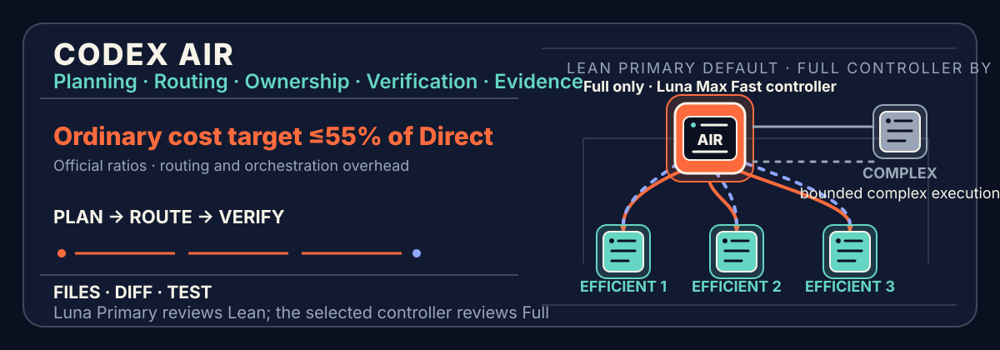

[简体中文](README.md) · [English](README.en.md)



<p align="center">
  <a href="https://github.com/SII-k7/codex-air/actions/workflows/posix-validation.yml"></a>
  <a href="https://github.com/SII-k7/codex-air/actions/workflows/windows-validation.yml"></a>
  <a href="https://github.com/SII-k7/codex-air/releases/latest"></a>
  <a href="https://github.com/SII-k7/codex-air/stargazers"></a>
  <a href="LICENSE"></a>
</p>

# Codex AIR

**Sol thinks it through. Luna carries it through.**

`codex-air` is an explicit-only Codex orchestration Skill invoked with
`$codex-air`:

- the **Sol xhigh control plane** owns intent, repository exploration,
  requirements, solution choice, scopes, orchestration, and final artifact
  review;
- the **Luna Max Fast execution plane** owns long-running implementation,
  tests, verification, and bounded correction;
- **Terra appears in no AIR route**;
- short work can stay Direct when orchestration would cost more than the task;
- only workstreams that pass a quantified gate launch two or three Luna
  executors concurrently.

Repository: [SII-k7/codex-air](https://github.com/SII-k7/codex-air). Codex AIR is independently designed and maintained by SII-k7; it is not an official OpenAI product or endorsement. `$codex-prove` remains an explicit compatibility command only.

## Is AIR for you?

| Use AIR | Keep using Codex directly |
| --- | --- |
| Cross-file refactors, migrations, and difficult bug fixes | Questions, explanations, or tiny localized edits |
| Work that needs repository exploration before long execution | Work already localized and finishable in minutes |
| Tasks with observable acceptance criteria, final-diff review, and test evidence | Open-ended discussion or solution brainstorming only |
| You want inexpensive Luna execution with a Sol final review | Your environment cannot use Codex Skills or custom agents |

AIR does not mean “launch agents for every request.” It activates only when you explicitly enter `$codex-air`, and admitted short tasks still stay Direct.

## 60-second quickstart

### Ubuntu / macOS / Linux

```sh
curl -fsSL https://chatgpt.com/codex/install.sh | sh
git clone https://github.com/SII-k7/codex-air.git
cd codex-air
bash scripts/validate.sh
bash scripts/install.sh
bash scripts/doctor.sh --require-codex
```

### Windows

```powershell
git clone https://github.com/SII-k7/codex-air.git
Set-Location codex-air
powershell.exe -NoProfile -ExecutionPolicy Bypass -File scripts/validate.ps1
powershell.exe -NoProfile -ExecutionPolicy Bypass -File scripts/install.ps1
```

Start a new Codex session after installation and paste this task:

```text
$codex-air

Goal: Refactor authentication while preserving the current API.
Done when: Tests and build pass; do not modify payments.
Output language: English.
```

Provide the goal, observable completion conditions, and hard boundaries. AIR chooses Direct, one executor, or a parallel route. See [copy-ready prompt recipes](docs/prompt-recipes.md) for more scenarios and the [Ubuntu guide](docs/ubuntu-cli-install.md) for detailed installation and troubleshooting.

Codex AIR is explicit-only. Requests without `$codex-air` remain Direct. Remove global routing left by an old install with `bash scripts/default.sh disable`.

## Why this architecture

The v1.0 difficult-coding A/B showed that Luna can reduce cost sharply, but it
also revealed two failure modes: open-ended exploration by Luna produced long
tool trajectories, and the absence of an independent final review allowed a
small number of high-value defects to reach delivery.

v1.1 reallocates work by comparative advantage:

```text
User request
   │
   ▼
Sol xhigh: understand → explore → REQ-ID → choose solution → exact packet
   │                                      │
   │                                      ├─ small work: Direct
   │                                      └─ long work: fork_turns="none"
   ▼
Luna Max Fast: verify decisive facts → implement → test → bounded correction
   │
   ▼
Git: deterministic candidate persistence
   │
   ▼
Same Sol xhigh: real files + complete diff + verifier review
   │
   └─ PASS / one focused FIX / BLOCKED
```

The point is not to launch more agents. It is to spend expensive Sol tokens only
on high-leverage semantic work and place most execution tokens on Luna. The
packet uses `fork_turns="none"`, so Luna does not inherit Sol's long exploration
context.

## v1.0.0 quantitative evaluation (historical architecture)

On 2026-08-23, Codex AIR completed a paired DeepSWE v1.1 hardest-10 A/B. Ten
difficult coding tasks each received one Direct Sol/xhigh/Standard attempt and
one v1.0 AIR attempt (thin Sol Host plus Luna Max Fast Primary), for 20 valid
cells under frozen task order, identical OCI images, and hidden verifiers.

| Metric | Direct Sol/xhigh | v1.0 AIR | Result |
| --- | ---: | ---: | --- |
| Strictly resolved | 2/10 | 1/10 | Strict quality non-inferiority was not established |
| Mean partial | 0.8943 | 0.8932 | Nearly equal; difference 0.0011 |
| Median task time | 20.3 min | 23.2 min | AIR was 14.4% slower |
| Median paired time ratio | 1.000× | 1.267× | AIR was slower on 9/10 tasks |
| Pro credits | 919.34 | 358.83 | AIR cost **39.0%** of Direct, saving **61.0%** |
| Input + output tokens | 56,005,220 | 177,272,916 | AIR used about **3.17×** as many tokens |

v1.0 therefore demonstrated that **more inexpensive Luna tokens can buy a much
lower cost**. It did not demonstrate fewer tokens or lower latency. See the
[DeepSWE v1.1 hardest-10 result](tests/deepswe-v11-hardest10-results.md) for all
tasks and runtime boundaries. This was a qualitative ten-task stress test with
one attempt per arm, not a statistically powered non-inferiority result.

The v1.1 Sol-control/Luna-execution design directly addresses those failure
modes, but **it has not yet received a new matched A/B**. The v1.0 61% saving is
not claimed as a verified v1.1 result.

## Core routing and projected savings

The table uses an all-Sol `1.00×` credit baseline and prices Luna **Fast** at
`0.125×` (Luna Standard `0.05×` multiplied by Fast's `2.5×` credits).
`Orchestration overhead` is added control, handoff, and rework cost relative to
the all-Sol baseline.

| Scenario | Example token routing | Orchestration overhead | Projected saving |
| --- | --- | ---: | ---: |
| **Clear long-running task** | Sol 20% · Luna Fast 80% | 3%–8% | **62.0%–67.0%** |
| **Typical complex coding task** | Sol 30% · Luna Fast 70% | 5%–12% | **49.3%–56.3%** |
| **High-risk or ambiguous task** | Sol 40% · Luna Fast 60% | 8%–15% | **37.5%–44.5%** |
| **Direct small task** | Current Codex handles it | 0% | **0% routing saving** |

These are `scenario_model_projection` ranges for budget planning. **These projections are not guarantees** and are not measured quality, latency, or per-task cost results. API dollars and ChatGPT/Codex credits
are different accounting units; actual model, tier, input, cached input, and
output must be priced separately.

### Official rates and calculation basis

Official short-context API prices checked on 2026-08-24, per 1M tokens:

| Model | Input | Cached input | Output |
| --- | ---: | ---: | ---: |
| GPT-5.6 Sol | $4.00 | $0.40 | $20.00 |
| GPT-5.6 Luna Standard | $0.20 | $0.02 | $1.20 |
| GPT-5.6 Luna Fast / Priority | $0.40 | $0.04 | $2.40 |

Codex token-based credits per 1M tokens:

| Model / tier | Input | Cached input | Output |
| --- | ---: | ---: | ---: |
| GPT-5.6 Sol Standard | 100 | 10 | 500 |
| GPT-5.6 Luna Standard | 5 | 0.5 | 30 |
| GPT-5.6 Luna Fast | 12.5 | 1.25 | 75 |

Projection formula:

```text
route_cost = sol_share × 1.00
           + luna_fast_share × 0.125
           + orchestration_overhead

saving = 1 - route_cost
```

OpenAI currently documents about **1.5×** generation speed and **2.5× ChatGPT
credits** for Codex Fast; API Fast/Priority uses its own published prices. The
actual response tier is authoritative, so AIR records both requested and actual
tier.

Official sources: [models overview](https://developers.openai.com/api/docs/models), [GPT-5.6 Luna](https://developers.openai.com/api/docs/models/gpt-5.6-luna), [API pricing](https://developers.openai.com/api/docs/pricing), [Codex Fast mode](https://learn.chatgpt.com/docs/agent-configuration/speed), and [Codex subagents](https://learn.chatgpt.com/docs/agent-configuration/subagents).

## How it works

### Controller selection

AIR prefers the current main session as its sole controller, but authoritative
runtime metadata must prove `gpt-5.6-sol` with at least `xhigh` reasoning. If it
cannot, AIR launches one `air-controller`; high-consequence work selects
`air-critical-controller` at entry. The Host then handles transport,
authorization, and candidate persistence only. It does not create a second plan
or semantic review.

### Role hierarchy

| Role | Configuration | Owns | Explicit boundary |
| --- | --- | --- | --- |
| **Controller** | `air-controller` → Sol / xhigh / Standard / read-only | Understanding, exploration, REQ-IDs, solution, decomposition, routing, final review | No routine implementation or second controller |
| **Critical controller** | `air-critical-controller` → Sol / xhigh / Standard / read-only | Authorization, safety, rollback, and final review for high-consequence work | Cost never overrides safety |
| **Efficient executor** | `air-efficient-worker` → Luna / max / Fast / workspace-write | Ordinary bounded implementation, verification, and correction | No global redesign, scope expansion, or overall approval |
| **Complex executor** | `air-complex-worker` → Luna / max / Fast / workspace-write | Public-interface, large-local-context, migration/concurrency, or high-consequence execution | Same model and price as Efficient; stricter execution contract only |
| **Challenger** | `air-challenger` → Sol / xhigh / Standard / read-only | Rare independent falsification check | Exceptional, read-only, and cannot approve |

All five agents pin `model_context_window = 272000` and
`model_auto_compact_token_limit = 244800`. Both Luna executors also use low
verbosity, no reasoning summary, a `4000` tool-output cap, no personality, and
disabled subagents to reduce non-delivery tokens and recursion.

### Route selection

| Route | Use it when | Execution |
| --- | --- | --- |
| **Direct** | Answer, tiny edit, or fully localized short task | Current Sol completes it without dispatch |
| **Controlled AIR** | Exploration, decomposition, long execution, or multi-file verification | One Sol controller plus one Luna executor by default |
| **Parallel AIR** | Parallel share ≥65%, largest branch ≤60%, coordination ≤15%, and disjoint writes | Same Sol controller plus 2–3 Luna executors |
| **Critical AIR** | Auth, secrets, payments, production, privacy, irreversible actions, migration, or concurrency correctness | Critical Sol controller plus bounded Luna execution |

### One complete evidence loop

1. **Sol understands and explores.** It reads applicable instructions and the
   needed code, producing stable `REQ-ID`s, decisive facts, one solution, exact
   scopes, baseline, and verifier.
2. **Compact handoff.** It sends an executable packet with `fork_turns="none"`
   instead of copying the full exploration transcript.
3. **Luna executes.** It verifies decisive facts first. A conflict returns
   `REPLAN_NEEDED` before writes; otherwise it implements, tests, and performs
   bounded correction continuously.
4. **Deterministic persistence.** Luna reports exact paths and SHA-256 hashes;
   the Host invokes `scripts/persist-visible-candidate.sh` so Git snapshots and
   replays the visible candidate.
5. **Sol reviews.** The same controller inspects real files, complete diff,
   requirement coverage, and the verifier. It allows one focused `FIX`.
6. **Verdict.** Only Sol can issue overall `PASS`; hard blockers or exhausted
   bounded recovery return `BLOCKED`.

### Non-negotiable boundaries

1. One file has one owner; shared interfaces and generated outputs are not
   written concurrently.
2. Luna executors cannot create subagents, widen authorization, redo the global
   solution, or approve the overall task.
3. Verification binds to the final candidate; later changes stale earlier
   behavioral evidence.
4. A child-worktree `PASS` is not delivery. Path, hash, or Git replay mismatch
   fails closed.
5. Challenger is not a permanent second controller and launches only for a
   concrete high-consequence falsification question.
6. Terra tokens, calls, and routes must stay zero.
7. Cost and latency goals never weaken authorization, verification, or evidence.

## Current status

The current stable version is [`v1.1.2`](https://github.com/SII-k7/codex-air/releases/tag/v1.1.2). `v1.1.2` improves first-run guidance, task examples, and community entry points; its runtime architecture is identical to `v1.1.0`.

| Surface | Status |
| --- | --- |
| v1.0 hardest-10 A/B | Complete: near-equal partial quality, 61% credit saving, slower latency, and one fewer strict resolution |
| v1.1 static contract | Sol xhigh control, Luna Max Fast execution, Terra=0, compact packets, final review, and validators are covered |
| v1.1 matched A/B | **Not run yet**; Direct Sol/xhigh and new AIR still need the same tasks and containers |
| Fast tier | Configuration always requests Fast; runtime telemetry must prove the actual response tier |
| CI | POSIX and Windows workflows cover validation, installation, and lifecycle surfaces |

## Install, check, and uninstall

```sh
bash scripts/validate.sh
bash scripts/install.sh
bash scripts/doctor.sh --require-codex
bash scripts/uninstall.sh
```

Use the corresponding `.ps1` scripts on Windows. The installer manages only
this project's Skill and five agent files; unrelated agents and the user's
`~/.codex/config.toml` remain untouched. Managed Codex PROVE/`sol-control`
installs can migrate transactionally and use `--restore-latest`. Restart Codex
after installation or upgrade.

## Repository layout

```text
.agents/skills/codex-air/       Skill, orchestration contract, runtime notes
.agents/skills/codex-prove/     Old-command compatibility entry
.codex/agents/                  Sol controller and Luna executor profiles
scripts/                        validate / install / doctor / uninstall
tests/                          contracts, lifecycle, persistence, benchmarks
docs/                           release evidence, designs, README assets
```

## Documentation

- [Public Skill](.agents/skills/codex-air/SKILL.md)
- [Orchestration contract](.agents/skills/codex-air/references/orchestration.md)
- [Runtime notes](.agents/skills/codex-air/references/runtime-notes.md)
- [Copy-ready prompt recipes](docs/prompt-recipes.md)
- [DeepSWE v1.1 hardest-10 result](tests/deepswe-v11-hardest10-results.md)
- [Runtime surface matrix](docs/release/runtime-surface-matrix.md)
- [Changelog](CHANGELOG.md)
- [Contributing](CONTRIBUTING.md)
- [Support and discussions](SUPPORT.md)
- [Security policy](SECURITY.md)

## Limitations

- v1.1 has no new matched A/B; projected savings are not measured results.
- Subagents, Fast tier, isolated worktrees, and capacity depend on the Codex
  runtime. AIR fails closed or reports `unobserved` without authoritative proof.
- One attempt on ten tasks cannot establish statistical non-inferiority.
- Historical benchmark and design documents retain old architecture descriptions
  and do not define current v1.1 routing.

## License

[Apache License 2.0](LICENSE)
