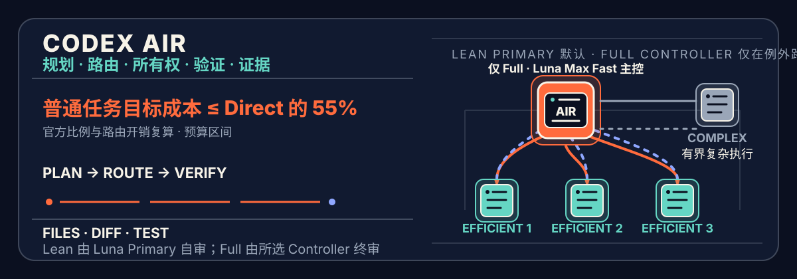
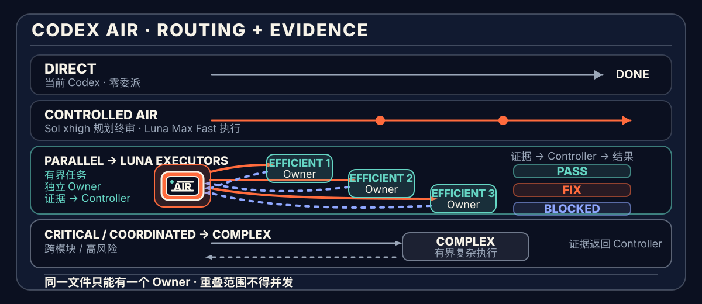

[简体中文](README.md) · [English](README.en.md)



<p align="center">
  <a href="https://github.com/SII-k7/codex-air/actions/workflows/posix-validation.yml"></a>
  <a href="https://github.com/SII-k7/codex-air/actions/workflows/windows-validation.yml"></a>
  <a href="https://github.com/SII-k7/codex-air/releases/tag/v1.0.0"></a>
  <a href="LICENSE"></a>
  <a href="https://github.com/SII-k7/codex-air/stargazers"></a>
</p>

# Codex AIR

**规划任务，路由模型，用证据完成交付。**

`codex-air` 是一个仅由 `$codex-air` 显式触发的模型中立 Codex 编排 Skill：**普通任务由一个 Luna Max Fast Primary 在单一语义上下文内端到端执行并审核；满足收益门槛的任务由 Luna Max Fast Controller 并行派发 2–3 个 Luna Max Fast owner，再做一次聚合审核。**

[60 秒开始](#60-秒开始) · [路由方式](#工作方式) · [成本模型](#为什么能节省成本) · [运行证据](#当前状态) · [安装维护](#安装检查与卸载)

你只需要给出目标、完成条件和限制；AIR 会自动完成规划、能力路由、文件 ownership、分阶段执行、验证和证据审核。

- **Lean Primary** 是默认路径：Host 直接转交原始请求，Luna Max Fast 独立完成要求、实现、验证与终态审核。
- **Parallel AIR** 只有在可并行工作 ≥65%、最大分支 ≤可并行部分的 60%、协调与集成开销 ≤Lean 串行工作的 15% 且 write scope 互斥时启动 2–3 个 Luna Max Fast worker；不满足就回退 Lean。
- **Controller** 只服务于通过上述门槛的并行任务、纯规划/审核或关键风险；普通 Controller 同样使用 Luna Max Fast，关键 Controller 才使用 Sol Max。
- **Complex worker** 只处理命中明确触发器的例外任务，例如高后果、并发、迁移、未决公共接口、不可约宽上下文或 Luna 零写入能力不匹配。
- **Efficient worker** 是有界可逆实现的默认 owner，以独立固定的 Luna Max Fast 承接诊断、普通多文件修改、测试、重构、文档与配置。

Codex AIR 现在是**仅显式触发**：只有当请求中包含 `$codex-air` 时才会启动；其他请求全部由当前 Codex 直接处理。旧版本启用过的全局默认路由可用 `bash scripts/default.sh disable` 安全清理。

运行时默认使用简体中文；如果用户明确指定其他语言，则遵循用户选择。

项目仓库：[SII-k7/codex-air](https://github.com/SII-k7/codex-air)。Codex AIR 由 SII-k7 独立设计和维护，不代表 OpenAI 官方产品或背书；`$codex-prove` 仅是旧命令的兼容入口。

## v1.0.0 定量评测结论

2026-08-23 完成了 DeepSWE v1.1 hardest-10 配对 A/B：10 道困难代码任务分别运行一次 Direct Sol/xhigh/Standard 与 Codex AIR（Sol/xhigh/Standard 薄 Host + Luna/max/Fast Primary），共 20 个有效单元，使用冻结任务顺序、同一 OCI 镜像与隐藏 verifier，并以 4 路并发执行。

| 指标 | Direct Sol/xhigh | Codex AIR | 定量结论 |
| --- | ---: | ---: | --- |
| 严格 resolved | 2/10 | 1/10 | AIR 少 1 题，严格质量门槛未通过 |
| 平均 partial | 0.8943 | 0.8932 | 几乎持平，差 0.0011 |
| 单题耗时中位数 | 20.3 分钟 | 23.2 分钟 | AIR 慢 14.4% |
| 配对耗时比中位数 | 1.000× | 1.267× | AIR 在 9/10 题更慢 |
| Pro credits | 919.34 | 358.83 | AIR 为 Direct 的 **39.0%**，节省 **61.0%** |
| 记录的 input + output tokens | 56,005,220 | 177,272,916 | AIR 使用约 **3.17×** token |

逐题 partial 为 AIR 4 胜、4 平、2 负；AIR 在 10/10 题更便宜，8/10 题不超过 Direct 一半，但只在 1/10 题更快。最强正例是 SQLFmt：AIR partial 更高、成本仅为 Direct 的 17.2%、耗时少 32.6%；主要缺口是 Kea 的 Direct 严格通过而 AIR 未通过，以及 Termenv 的 AIR partial 低 0.0246。

因此，v1.0.0 的准确结论是：

- **成本目标通过：**聚合成本明显低于一半，Luna 确实接过了主要工作；
- **严格质量非劣性尚未建立：**平均 partial 几乎相同，但 10 题单次样本中 resolved 少 1 题；
- **速度目标未通过：**AIR 的配对典型耗时高 26.7%；
- **省的是价格而不是 token：**AIR 用更多廉价且高缓存命中的 Luna token 换取较低 credits。

有效 A/B 消耗 1,278.17 credits；保守计入 25.88 credits 的作废基础设施批次后总计 1,304.05，低于 1,800 上限。4 路并发墙钟时间为 2 小时 12 分 47 秒。完整逐题表、运行边界与 verifier 修正说明见 [DeepSWE v1.1 hardest-10 结果](tests/deepswe-v11-hardest10-results.md)。这是 10 题、每个 arm 单次尝试的定性压力测试，不是统计意义上的非劣性证明。

这次结果也给出了明确的 v1.1 优化信号：固定编排对短任务的启动成本过高；Luna 工具轨迹使 AIR 的原始 token 膨胀到 3.17 倍；薄 Host 没有在 Kea、Termenv 暴露证据缺口时触发有界修复；路由尚未根据任务的预计收敛时间动态选择 Direct。下一步应加入短任务 Direct 准入门、Luna 墙钟/工具轮次预算与早停，以及只在测试失败或证据不足时触发的有上限 Sol 审查。并行仍只用于真正独立的 workstream。以上是由本次样本导出的待验证假设，不是已经实现或已证明的 v1.1 收益。

## 核心路由与预计节省

下表以“同一任务全部使用 Sol”为 `1.00×` 基线。三个模型的 token 份额合计为 100%，`编排开销`表示额外的规划、审核、协调和必要返工，相对于全 Sol 基线增加的成本。Lean AIR 的运行目标是 Luna 至少承担 70% token、Sol 不超过 30%。

| 场景 | 示例 token 路由 | 编排开销 | 预计节省 |
| --- | --- | ---: | ---: |
| **普通明确型项目** | Sol 10% · Terra 20% · Luna 70% | 3%–7% | **69.5%–73.5%** |
| **混合型项目** | Sol 20% · Terra 40% · Luna 40% | 2%–12% | **46.0%–56.0%** |
| **复杂型项目** | Sol 25% · Terra 60% · Luna 15% | 7%–17% | **27.2%–37.2%** |
| **Direct 小任务** | 当前 Codex 直接完成，不委派 | 0% | **路由节省 0%** |

这些区间是基于公开的 Codex token credits 和示例 token 份额的 `scenario_model_projection`，用于预算规划，**不是每个任务的保证，也不代表一定更快**。
这些区间使用 Standard tier 的 credits 权重；API 美元价格已不再与 credits 保持相同比例，必须按下文的实际 token 类型与 tier 单独复算。本分支现已单独固定 Luna Fast，因此实际 Luna API 成本会高于 Standard tier 投影。

## 60 秒开始

### Ubuntu / macOS / Linux

```sh
curl -fsSL https://chatgpt.com/codex/install.sh | sh

git clone https://github.com/SII-k7/codex-air.git
cd codex-air

bash scripts/validate.sh
bash scripts/install.sh
bash scripts/doctor.sh --require-codex
bash scripts/default.sh status
```

### Windows

Windows PowerShell 5.1：

```powershell
git clone https://github.com/SII-k7/codex-air.git
Set-Location codex-air

powershell.exe -NoProfile -ExecutionPolicy Bypass -File scripts/validate.ps1
powershell.exe -NoProfile -ExecutionPolicy Bypass -File scripts/install.ps1
```

PowerShell 7：

```powershell
pwsh -NoProfile -File scripts/validate.ps1
pwsh -NoProfile -File scripts/install.ps1
```

安装后打开一个新的 Codex 会话：

```text
$codex-air

目标：为现有项目增加账号设置功能。
完成条件：用户可以修改昵称和头像；现有认证 API 保持兼容；测试和构建通过。
限制：不修改支付模块，不更换现有 UI 框架。
```

也可以直接写：

```text
$codex-air 重构认证模块，保持现有 API 兼容，测试和构建必须通过。
```

不需要指定 worker 数量或模型。普通单 owner 工作直接进入 Lean AIR；只有通过量化门槛的独立 workstream 才形成 Parallel AIR，关键风险仍进入 Critical AIR。

## 先判断是否值得编排

| 直接交给当前 Codex | 显式使用 `$codex-air` |
| --- | --- |
| 单文件、小改动、已定位的问题 | 多模块、强依赖、共享接口或高后果修改 |
| 简单回答、确定性命令、短文本 | 需要拆分、并行、ownership 或独立证据审核 |
| 编排成本高于实现成本 | 返工代价明显高于规划和审核开销 |

AIR 不是默认模式，也不是固定 Agent 团队。它只在编排能提高交付质量或降低总成本时使用 worker。

## 为什么能节省成本

Codex AIR 的节省逻辑很直接：

> **让 Luna 承担普通任务的诊断、实现、测试与普通协调；只把关键风险和必要的紧凑审查留给 Sol。**

按 **2026-08-24** 的官方短上下文 API 价格，不同 token 类型的相对成本为：

| 模型 | 相对成本 | 在本项目中的职责 |
| --- | ---: | --- |
| **Sol** | **1.00×** | 仅关键 Controller 与按风险触发的必要 Challenger；普通 Lean 零 Sol child |
| **Terra Max** | **0.50× input/cached；0.60× output** | 命中明确复杂触发器或高后果的执行 |
| **Luna Max** | **0.05× input/cached；0.06× output（Standard）** | Lean Primary 与普通协调 Controller；两个自定义 agent 请求 Fast |

也就是说，在相同 token 类型下：

- Terra Standard 是 Sol Standard 的 **50% input/cached、60% output**；
- Luna Standard 是 Sol Standard 的 **5% input/cached、6% output**；Luna Fast 是 **10% input/cached、12% output**；
- Luna 是普通路径的主执行与主协调能力；Sol 保留关键风险和最终安全边界。

这些数字属于 `scenario_model_projection`：它们用于预算规划，**不是匹配 A/B 实验、不是每个任务的保证，也不代表一定更快**。上下文重复、错误拆分、并行等待、输出量、Fast mode 和返工都可能降低甚至反转节省。

Luna Primary 与普通 Controller 都永久固定 `model_reasoning_effort = "max"`、
`service_tier = "fast"` 和 `features.fast_mode = true`，所以它们不跟随主会话的
`/fast` 状态，也不会为省额度而降档。OpenAI 当前说明 Codex Fast 的生成速度为
**1.5×**、在 ChatGPT 订阅中消耗 **2.5× credits**；通过 API 使用 Priority 时，
当前短上下文 Luna Fast 单价是 Standard 的 **2×**。响应中的实际 tier 才是权威值，降级为
Standard 时必须按 Standard 复算。上面的场景投影明确使用 Codex credits 的 Standard 权重；
新的匹配评测使用实际请求/响应 tier，并以 `AIR / Direct <= 0.55` 为目标。

两个 Luna profile 还固定 `model_verbosity = "low"`、
`model_reasoning_summary = "none"`、`tool_output_token_limit = 4000` 和
`personality = "none"`，减少非交付性输出与过长工具回传；这些配置不会降低
`model_reasoning_effort = "max"`。Efficient profile 另外关闭子代理，避免普通
Lean 路径递归扩张；Controller 保留协调型 Full AIR 所需的派发能力。

Sol/Terra 自定义 agent 固定 `service_tier = "default"`。这是对 Codex
多 Agent 运行时可能把已关闭的 Fast 状态错误带入新子线程的防护（参见
[OpenAI Codex #38277](https://github.com/openai/codex/issues/38277)）：AIR
不会再让关键 Controller、Complex worker 或 Challenger 静默消耗 Fast 额度。
代价是主会话的 `/fast` 不再改变这些非 Luna 角色；两个 Luna 角色保持 Max + Fast。

五个 AIR 自定义 agent 还固定 `model_context_window = 272000` 与
`model_auto_compact_token_limit = 244800`。自定义 agent 是子会话配置层，省略
这些键会继承主会话；显式固定后，用户在 `~/.codex/config.toml` 中为主会话
设置的 `512000/400000` 不会传给 AIR 子代理。272K 是当前 Codex GPT-5.6
默认原始窗口，自动压缩阈值按官方实现取 90%；Codex 的 95% 有效窗口规则会让
子代理界面显示约 258.4K。未来 Codex 默认值变化时，本项目会随模型配置一并更新。

因此，更准确的公开说法是：

> **普通明确型项目可投影节省约 70%–74%，典型混合项目约 46%–56%，复杂项目约 27%–37%；实际结果必须按真实路由和 token 使用复算。**

而不是把所有任务概括成一个固定的“平均节省 56%”。

<details>
<summary><strong>查看官方费率、公式与完整计算</strong></summary>

### API 价格

每 1M tokens：

| Model | Input | Cached input | Output |
| --- | ---: | ---: | ---: |
| GPT-5.6 Sol | $4.00 | $0.40 | $20.00 |
| GPT-5.6 Terra | $2.00 | $0.20 | $12.00 |
| GPT-5.6 Luna | $0.20 | $0.02 | $1.20 |
| GPT-5.6 Luna Fast | $0.40 | $0.04 | $2.40 |

### Codex token-based credits

每 1M tokens：

| Model | Input | Cached input | Output |
| --- | ---: | ---: | ---: |
| GPT-5.6 Sol | 100 credits | 10 credits | 500 credits |
| GPT-5.6 Terra | 50 credits | 5 credits | 300 credits |
| GPT-5.6 Luna | 5 credits | 0.5 credits | 30 credits |

Codex token-based credits 的相对权重仍为：

```text
Sol = 1.00
Terra = 0.50
Luna = 0.05
```

因此下列公式只用于 credits 场景投影，不能直接代替 API 美元计算：

```text
route_cost =
  sol_share × 1.00
  + terra_share × 0.50
  + luna_share × 0.05
  + orchestration_overhead

saving = 1 - route_cost
```

普通明确型项目示例：

```text
route_cost
= 0.10 × 1.00
+ 0.20 × 0.50
+ 0.70 × 0.05
+ 0.03–0.07
= 0.265–0.305

saving
= 1 - 0.265–0.305
= 69.5%–73.5%
```

API 用户看到的是美元金额；ChatGPT / Codex 用户通常看到的是 credits 或订阅容量。两者是不同计费单位，不能把 API 美元节省直接描述成订阅账单节省。

官方来源：

- [OpenAI model comparison](https://developers.openai.com/api/docs/models/compare)
- [OpenAI API pricing](https://developers.openai.com/api/docs/pricing)
- [OpenAI Codex pricing](https://learn.chatgpt.com/docs/pricing)
- [OpenAI Codex rate card](https://help.openai.com/en/articles/20001106-codex-rate-card)
- [OpenAI Codex Fast mode](https://developers.openai.com/codex/agent-configuration/speed)

少量仍使用 legacy rate card 的 Enterprise 工作区，应以其实际适用费率为准。

</details>

## 它解决什么问题

| 常见问题 | Codex AIR 的处理方式 |
| --- | --- |
| 每个小任务都先启动昂贵 Controller | Lean Primary 让 Luna 端到端执行并审核，Host 只负责派发与结果转交 |
| 子 Agent 显示已修改、主工作区却没有变化 | 子 Agent 只返回路径与最终哈希；Host 让 Git 快照并重放可见候选，通过持久化门禁后才交付 `PASS` |
| 所有工作都使用最高成本模型 | 按能力需求路由到 efficient 或 complex profile |
| 多个执行者同时修改共享文件 | **一个文件，一个 owner**；重叠范围必须串行 |
| “完成”只有口头总结，没有真实证据 | 必须返回 changed paths、diff、测试、构建或产物 |
| 错误任务被无限重试或过早终止 | 每个候选只允许一次 focused fix；可恢复阻塞可在同轮做一次 Recovery Re-plan |

它的目标不是制造一个热闹的多 Agent 团队，而是在普通任务上保持最短路径，在复杂任务上建立清晰、可审核的控制面。

## 工作方式



```text
用户目标
   │
   ▼
Host：风险与路由门禁
   │
   ├─ Direct：简单任务由当前 Codex 直接完成
   ├─ Lean：Luna Primary 要求拆解 → 实现 → 验证 → 最终审核
   ├─ Parallel：收益门槛通过 → Luna Controller → 2–3 个 Luna Fast workers
   └─ Critical：Sol Controller → complex / isolated efficient workers
   │
   ▼
Lean：Luna Primary → PASS / REVIEW_REQUIRED / BLOCKED
Full：所选 Controller → PASS / FIX / BLOCKED
   │
   ▼
Host：Git 机械快照并重放候选、核对路径/哈希；不读取候选语义、不重复审核
```

<details>
<summary><strong>展开完整控制协议：角色、路由、并行、验证与失败处理</strong></summary>

<br>

### 证据优先控制

当前契约让 Lean 路径保持零 Controller；Full 路径保持单一 Controller，并包含五个质量控制点：

1. **需求—证据图。** 每个 `done_when` 使用稳定的 `REQ-ID`，任务、验证和最终证据必须回指对应要求。
2. **Artifact-first 审核。** Lean 的 Luna Primary 或 Full 的 Controller 先看原始要求、真实 changed paths、文件、完整 diff 和验证产物；Host 不重复读取与审核。
3. **验证验证器。** 退出码为 0 还不够；检查必须命中最终候选、正确 scope 和目标要求，存在性检查或跑错模块不能通过。
4. **选择性挑战。** Lean 和普通协调任务零额外挑战；只有关键风险、最终候选证据实质冲突，或安全/授权要求仍未解决时，才允许最多一个只读 challenge。它只返回 findings，最终裁决仍属于 Full Controller。
5. **可恢复执行。** 长任务记录 owner、候选身份、要求覆盖、尝试次数和 recovery chain；运行时、依赖或验证故障可在同一轮重规划，不重复已完成任务，也不重置任何预算。

### 角色层级

| 角色 | 配置 | 负责什么 | 明确边界 |
| --- | --- | --- | --- |
| **Controller** | `air-controller` → `gpt-5.6-luna` / `max` / `fast` / `read-only` | 负责 Parallel AIR 的量化准入、规划、路由、ownership 与一次聚合审核 | 永久 Max + Fast，不承担实现；Lean 不启动它 |
| **关键 Controller** | `air-critical-controller` → `gpt-5.6-sol` / `max` / `default` / `read-only` | 认证、密钥、支付、迁移、并发、生产、隐私或不可逆任务的规划与终审 | 固定 Standard；只在入口选用，不与标准 Controller 并存 |
| **Complex worker** | `air-complex-worker` → `gpt-5.6-terra` / `max` / `default` / `workspace-write` | 显式例外：架构/公共接口判断、不可压缩长上下文、迁移/并发正确性或高后果实现 | 固定 Standard；必须记录升级原因，不创建子代理 |
| **Efficient / Lean Primary** | `air-efficient-worker` → `gpt-5.6-luna` / `max` / `fast` / `workspace-write` | Lean 下端到端拥有要求、实现、验证、产物审核与终态裁决；Full 下是 bounded leaf | Fast 固定；不扩大 scope、不创建子代理；仅 Lean 模式可批准整体任务 |
| **Challenger** | `air-challenger` → `gpt-5.6-sol` / `max` / `default` / `read-only` | 对最终候选做一次有界对抗式证据检查 | 固定 Standard；普通任务零调用、无写权限、无批准权 |

角色名保持稳定，箭头右侧是本优化分支的默认配置。未来模型换代只更新 TOML、验证与发布说明，不再更改项目名或协议。

### 路由选择

| 路径 | 什么时候使用 | 成本含义 |
| --- | --- | --- |
| **Direct** | 没有显式调用 `$codex-air` | 不承担 AIR 编排开销，路由节省为 0% |
| **Lean Primary** | 显式 AIR、单 logical owner、可回滚 workspace scope | 默认路径；Luna 单一上下文完成要求、实现、验证和审核；普通任务零 Sol child |
| **Parallel AIR** | 2–3 个独立 owner，且可并行占比 ≥65%、最大分支 ≤可并行部分的 60%、协调/集成 ≤Lean 串行工作的 15% | Luna Controller + 2–3 个同级 Luna Max Fast workers；否则 `LEAN_RECOMMENDED` |
| **Critical/Controller → complex** | 关键风险、架构/公共接口、迁移/并发、不可压缩上下文或证据冲突 | Sol 关键 Controller 或 Luna 协调 Controller 调用 Terra |

Complex worker 不是 efficient worker 的固定上级，也不是常驻第二主控。Lean 直接使用 efficient；Full 才由所选 Controller 按能力需求选择 worker。

Luna `max` 现在是普通任务唯一的语义任务上下文所有者。它在同一上下文内提取要求、记录 baseline、定位根因、完成修改、验证最终候选并给出终态裁决。Codex 子 Agent 可能运行在隔离 worktree，因此 Luna 必须让已审核候选保持会话可见，并只返回精确相对路径与最终文件哈希；Host 让 Git 自己生成 binary diff、反向重放再正向重放，不把补丁正文送入模型，不读候选语义、不重跑测试、不做第二次语义审核。只有多 owner 协调、架构/公共接口、迁移/并发、不可压缩上下文、实质证据冲突或关键风险才进入 Full。

### 多个执行者如何协作

通过门槛的任务可同时使用 2–3 个 worker，但并行由**文件所有权和关键路径收益**共同决定，而不是由 Agent 数量决定：

```text
Stage 1
├─ Complex A   → src/auth/core/*
├─ Efficient A → src/account/ui/*
└─ Efficient B → docs/account.md

Stage 2
└─ 原指定 owner → src/shared/routes.ts
```

只有 write scope 完全不重叠的任务才能同时执行。共享文件必须指定唯一 owner；依赖、共享接口或边界不确定时，Controller 会合并任务或改为串行执行。

普通 Parallel AIR 最多同时运行 3 个 leaf。Controller 把同一 ready frontier 一次并发启动，以一次长等待收齐结果，按 Task ID 组装互斥路径/哈希的 union manifest，只做一次 Git 持久化，再进行一次聚合审核；更宽的图按依赖分 wave。实时容量不足或门槛不成立时回退 Lean，不用 Terra 冒充“加速 worker”。

## 一条完整的证据闭环

1. **派发。** Host 只转交原始请求、显式约束、workspace 与授权边界。
2. **提取要求。** Luna Primary 给每条完成条件分配稳定 `REQ-ID` 与所需证据。
3. **执行。** Luna Primary 记录 baseline、诊断、修改并运行验证。
4. **自审。** 同一 Primary 检查真实文件、完整 diff、验证器目标与最终候选。
5. **结论。** Lean 返回 `PASS / REVIEW_REQUIRED / BLOCKED`；Full Controller 返回 `PASS / FIX / BLOCKED`。
6. **持久化并转交。** Host 核对最终哈希后，让 Git 在一个事务内快照、反向重放并正向重放会话可见候选，再交付结构化终态；不重复语义裁决。

Full 中 leaf worker 的 `PASS` 只代表自己的任务；Lean Primary 可以批准整体 Lean 工作。Host 在两条路径上都只转交终态结果。

## 不可妥协的边界

1. **一个文件，一个 owner。** 同一轮执行中，不允许两个 worker 修改同一文件。
2. **执行 profile 不能创建子代理。** Complex 与 efficient profile 都不递归；efficient 在 Lean 是 Primary，在 Full 是 leaf。
3. **没有证据，不算完成。** transport / spawn 的 `completed` 只表示投递结束。
4. **验证必须绑定最终候选。** 验证后文件发生变化，旧证据立即失效。
5. **修正和恢复都有硬边界。** 每个候选最多一次 focused fix；可恢复的失败链最多一次同轮 Recovery Re-plan，仍失败才 `BLOCKED`。
6. **能力不等于授权。** 运行时暴露更宽技术能力不会扩大用户授权或 `write_scope`；Lean Primary 自己记录 baseline 并核对最终 changed paths。
7. **不降低审核门槛。** 用户催促、并行需求或成本目标都不能替代验证与证据。
8. **没有产物证据就不能 PASS。** Lean Primary 或 Full Controller 必须按真实产物、完整 diff 与最终候选建立结论；Host 不做第二次模型审核。
9. **子工作树结果必须真正落地。** write-capable child 的 `PASS` 不是持久化证据；候选不可见、路径/哈希不匹配、非 Git 根或 Git 重放失败都会直接失败关闭，不让模型猜测或重写补丁。
10. **挑战不是第二主控。** 只读 challenge 无写权限、无批准权，且普通任务不承担固定调用开销。
11. **高风险仍然失败关闭。** 模型身份、fork 或必要范围证据无法证明时阻塞；破坏性、生产或不可逆外部操作还必须有可强制的匹配边界，或用户明确批准更宽能力。

### Efficient 到 complex 的有界升级

只有当 efficient worker 的第一次失败发生在它写入任何 owned file **之前**，Controller 才能把同一任务、同一 scope 一次升级给 complex profile。

升级门槛只看首次失败前是否零写入。

一旦 worker 已经写入 owned file，该路径属于稳定的 logical owner。Controller 只能把 focused fix 或同轮恢复交回这个 owner，不能转交给其他 profile 覆盖；worker 进程若已退出，只能在重新证明身份并快照现有产物后，用同一 exact profile 恢复同一 owner slot。

focused fix 失败不再自动结束整个 AIR。对于 `runtime`、`timeout`、`dependency`、`verification` 或 `evidence_quality`，Full Controller 会保留同一 `run_id`、已完成证据、ownership 和尝试次数，为受影响的 Requirement chain 创建一次带 new Task ID、material Delta、精确 scope 与恢复条件的 Recovery Re-plan。已写路径仍归原 logical owner；完全不重叠的新阻塞修复范围才可分配新 owner。原 agent 仍存活时直接复用，不需要身份握手，也无需用户再次输入 `$codex-air`。

为了避免通过改任务名无限重试，每条 Requirement chain 只有一次 Recovery Re-plan，恢复任务也只有一次 focused fix。缺少实质 Delta、权限/身份/越界/不可逆阻塞，或该恢复链再次失败时才返回终局 `BLOCKED`。

## 审核结果

| 结果 | 含义 |
| --- | --- |
| `PASS` | 所有完成条件均由真实文件和新鲜证据支持 |
| `FIX` | 中间控制动作：原 logical owner 执行 focused fix，或 Controller 进入符合条件的同轮恢复 |
| `BLOCKED` | 存在硬阻塞、没有 material recovery Delta，或有界恢复链已经耗尽 |

三个结果构成封闭裁决。可选改进与 residual suggestions 保持在裁决之外；但任何未满足的 `REQ-ID` 都不能被降级为建议。

</details>

## 什么时候不该使用

以下情况通常直接交给当前 Codex 更合适：

- 修改一个明确的小函数；
- 修复已定位的拼写、文案或样式；
- 只需要解释代码、回答问题或生成短文本；
- 无法划分独立 write scope；
- 编排、重复上下文与审核成本明显高于实现本身。

Codex AIR 不会隐式启动。**只有包含 `$codex-air` 的请求进入编排，其他请求始终保持 Direct。**

## 安装、检查与卸载

### Ubuntu / macOS / Linux

```sh
# 升级自曾启用全局默认路由的旧版本时，先清理受管区块；重复执行安全
bash scripts/default.sh disable

bash scripts/validate.sh
bash scripts/install.sh --check
bash scripts/install.sh
bash scripts/doctor.sh --require-codex
bash scripts/default.sh status
bash scripts/uninstall.sh
bash scripts/uninstall.sh --restore-latest
```

### Windows

```powershell
# Windows PowerShell 5.1
powershell.exe -NoProfile -ExecutionPolicy Bypass -File scripts/validate.ps1
powershell.exe -NoProfile -ExecutionPolicy Bypass -File scripts/install.ps1
powershell.exe -NoProfile -ExecutionPolicy Bypass -File scripts/uninstall.ps1
powershell.exe -NoProfile -ExecutionPolicy Bypass -File scripts/uninstall.ps1 -RestoreLatest

# PowerShell 7
pwsh -NoProfile -File scripts/validate.ps1
pwsh -NoProfile -File scripts/install.ps1
pwsh -NoProfile -File scripts/uninstall.ps1
pwsh -NoProfile -File scripts/uninstall.ps1 -RestoreLatest
```

安装器只管理本项目拥有的 Skill 与 agent 文件，并保留无关 agent 和用户自己的 `~/.codex/config.toml`。`default.sh disable` 只清理旧版本写入 `~/.codex/AGENTS.md` 的受管 AIR 区块，保留其他全局指令并先备份；`enable` 已被明确拒绝。`doctor.sh` 会检查五个模型档位、服务档位、子代理上下文隔离、多 Agent 开关和 explicit-only 路由。隔离生命周期测试时可使用 `ORCHESTRATE_HOME` 指定临时 home。

安装或升级后必须结束旧 Codex 会话并重新运行 `codex`。在新会话中用 `/skills` 检查 `$codex-air`，用 `/agent` 检查自定义代理；模型授权与真实运行选择依赖 Host/tool 的权威 launch record，实际 Fast tier 只有运行响应遥测才能证明，不再消耗单独握手回合。

安装器支持从旧 Codex PROVE 与更早的 `sol-control` 受管版本迁移：先校验旧 Skill、Agent 与 ownership state，再备份并原子安装到 `~/.agents/skills/codex-air` 和 `~/.codex/codex-air`。同时安装 `$codex-prove` 兼容入口。`--restore-latest` 可恢复升级前的完整可管理状态；检测到用户修改、无 ownership 的同名目标或校验失败时会停止，不会覆盖。

平台与证据覆盖详见 [`docs/release/runtime-surface-matrix.md`](docs/release/runtime-surface-matrix.md)。

## 当前状态

当前稳定版本是 [`v1.0.0`](https://github.com/SII-k7/codex-air/releases/tag/v1.0.0)，发布提交由 `main` 跟踪。

> **迁移说明：**Codex PROVE 已更名为 Codex AIR。新入口是 `$codex-air`；`$codex-prove` 只作为显式兼容别名。安装器可事务迁移受管旧版本，`--restore-latest` 可恢复升级前状态。

| 验证面 | 已记录证据 |
| --- | --- |
| 本地仓库 | `$codex-air` 与兼容入口符合 Skill Creator 结构契约；仓库静态验证、事务安装/回滚、Windows 脚本表面与完整测试套件共同覆盖迁移边界 |
| 匹配评测 | 改名前的相同架构在 FeatureBench MLflow 任务上与 Direct Sol/xhigh 都通过 18/18 F2P 和 139/139 P2P；AIR 的新低延迟配置尚待独立复测 |
| 新困难评测 | 完整 113 题协议仍保持冻结、尚未运行；已完成 hardest-10 配对 A/B：AIR 平均 partial 0.8932 对 Direct 0.8943，credits 为 39.0%，配对耗时比中位数为 1.267，严格 resolved 为 1/10 对 2/10 |
| 托管 CI | [POSIX 工作流](https://github.com/SII-k7/codex-air/actions/workflows/posix-validation.yml)：Ubuntu/macOS × Python 3.11/3.13；[Windows 工作流](https://github.com/SII-k7/codex-air/actions/workflows/windows-validation.yml)：Windows Server 2022 / `windows-latest` × Windows PowerShell 5.1 / PowerShell 7 |
| Windows 实机安装 | 用户报告安装成功；未收集 Windows 版本、安装日志或运行时身份载荷，因此不扩展为 Native Nested 证明 |
| 迁移前正式运行证据 | 单一 Luna/max Primary、零 Controller/Terra/Sol child；质量与 Direct 持平，模型用时为 Direct 的 2.105×，按 Luna Fast 价格折算的 API 等价成本为 Direct 的 0.527×；因此当前优化重点是缩短 Luna 工具轨迹 |
| 运行表面 | Lean Primary 与上游 Compatibility 路径已验证；实际 Fast 响应 tier 仍为 `unobserved`，其余四个优化角色、Native Nested 与物理 Windows 11 运行时仍单独标注为未验证 |

Codex AIR 将品牌、Skill 与 Agent 角色从旧项目名解耦，同时保留 Requirement ID、产物优先审核、验证者校验、有限只读挑战与恢复包；完整设计与证据见 [AIR 实施报告](CODEX_AIR_V1_IMPLEMENTATION_REPORT.md)。早期迁移历史保留在[迁移报告](CODEX_AIR_MIGRATION_REPORT.md)。

这些状态描述的是已记录证据范围，不推断未验证运行表面。

## 仓库结构

```text
.agents/skills/
├─ codex-air/                规范 Skill 与调用入口
│  ├─ SKILL.md
│  └─ references/
│     ├─ orchestration.md      编排契约
│     └─ runtime-notes.md      运行时与能力 profile
└─ codex-prove/              旧命令的显式兼容入口

.codex/agents/
├─ air-controller.toml
├─ air-critical-controller.toml
├─ air-complex-worker.toml
├─ air-efficient-worker.toml
└─ air-challenger.toml

scripts/
├─ validate.*
├─ install.*
├─ uninstall.*
├─ default.sh
├─ doctor.sh
└─ test.sh

tests/                         contract、生命周期与 forward-case 测试
docs/                          发布证据、设计记录与 README 资源
README.md                      简体中文
README.en.md                   English
```

## 文档入口

- [Public Skill](.agents/skills/codex-air/SKILL.md)
- [编排契约](.agents/skills/codex-air/references/orchestration.md)
- [运行时与能力 profile](.agents/skills/codex-air/references/runtime-notes.md)
- [Ubuntu Codex CLI 安装指南](docs/ubuntu-cli-install.md)
- [Controller 配置](.codex/agents/air-controller.toml)
- [关键 Controller 配置](.codex/agents/air-critical-controller.toml)
- [Complex worker 配置](.codex/agents/air-complex-worker.toml)
- [Efficient worker 配置](.codex/agents/air-efficient-worker.toml)
- [Challenger 配置](.codex/agents/air-challenger.toml)
- [运行表面矩阵](docs/release/runtime-surface-matrix.md)
- [真实项目路由样本](tests/real-project-benchmark.md)
- [v1.0 匹配 A/B 协议](tests/v100-ab-benchmark.md)
- [DeepSWE v1.1 困难代码 A/B](tests/deepswe-v11-ab.md)
- [DeepSWE v1.1 hardest-10 定量结果](tests/deepswe-v11-hardest10-results.md)
- [v1.0 真实匹配 smoke 证据](tests/v100-live-smoke.md)
- [v1.0 证据优先实现报告](CODEX_AIR_V1_IMPLEMENTATION_REPORT.md)
- [迁移历史](CODEX_AIR_MIGRATION_REPORT.md)

## 维护与支持

维护组织：[@SII-k7](https://github.com/SII-k7)。项目支持当前 `main`；具体环境边界和求助渠道见 [SUPPORT.md](SUPPORT.md)。提交改进前请阅读 [CONTRIBUTING.md](CONTRIBUTING.md) 和 [CODE_OF_CONDUCT.md](CODE_OF_CONDUCT.md)，可复现问题请使用仓库的结构化 [Issue 模板](https://github.com/SII-k7/codex-air/issues/new/choose)。

## 安全

安全问题不要提交公开 Issue，也不要附带 Token、私有路径或私有仓库内容。请阅读 [SECURITY.md](SECURITY.md)，并通过 GitHub [私密漏洞报告](https://github.com/SII-k7/codex-air/security/advisories/new)提交。

## 开发与测试

需要 Python 3.11 或更高版本。

```sh
bash scripts/validate.sh
bash scripts/test.sh
python3 scripts/benchmark_ab.py validate tests/fixtures/v100-ab-benchmark.json
python3 -m json.tool tests/fixtures/deepswe-v11-ab.json >/dev/null
```

`scripts/test.sh` 会选择可用的 Python 3.11+，并运行完整 `unittest` 测试集。
`benchmark_ab.py` 只冻结实验、生成交叉顺序并汇总完整结果；它不会调用模型，也不会在没有实测 cell 时宣布赢家。

修改 README 时应同步更新双语版本与文档测试。测试应保护事实、链接、费率快照、公式、安全边界和平台命令，不应把某一种营销文案或首页章节顺序永久锁死。

## 限制

- 成本区间是基于公开费率与示例 token 份额的预算投影，不是匹配 A/B benchmark。
- 真实 token 总量可能因规划、上下文重复、验证和返工而变化。
- Fast mode、超长上下文和不同输出比例可能改变实际消耗。
- 精确 custom agent、model、reasoning effort 与权限选择取决于宿主运行表面。
- Parallel AIR 只承诺协议上限（2–3 个 leaf、最多 3 个并发）；能否启动仍取决于量化门槛、实时容量和互不重叠的 write scope。
- GitHub 托管 Windows runner 证明的是 Windows Server 行为，不等同于物理 Windows 11。
- Complex worker 是复杂执行层，不是第二 planner 或 controller。
- AIR 表示受证据约束的验证流程，不保证绝对正确。
- 最终交付依赖真实文件、完整 diff 与新鲜验证；配置标签本身不是运行证据。

## 许可证

本仓库采用 [Apache License 2.0](LICENSE)。相关先例与归属记录见 [NOTICE](NOTICE)。

**致谢 / Thanks**

感谢 [LINUX DO 论坛](https://linux.do/) 社区的关注、反馈与支持
